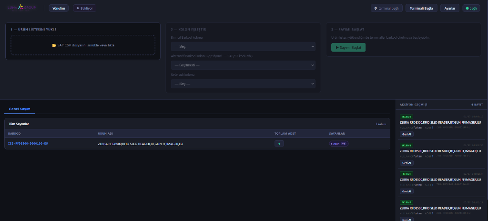
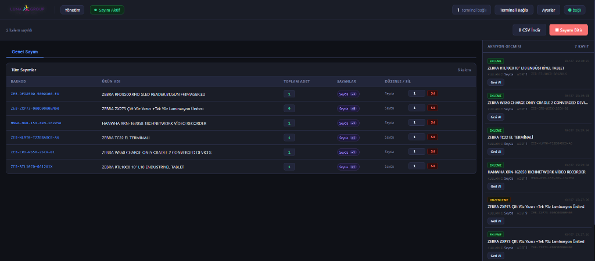
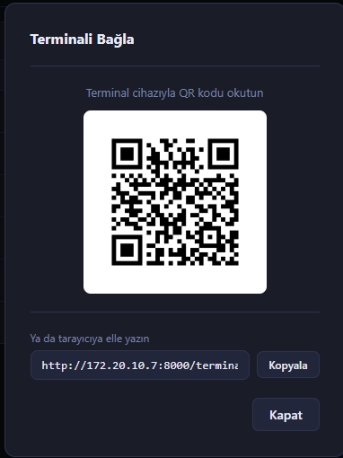
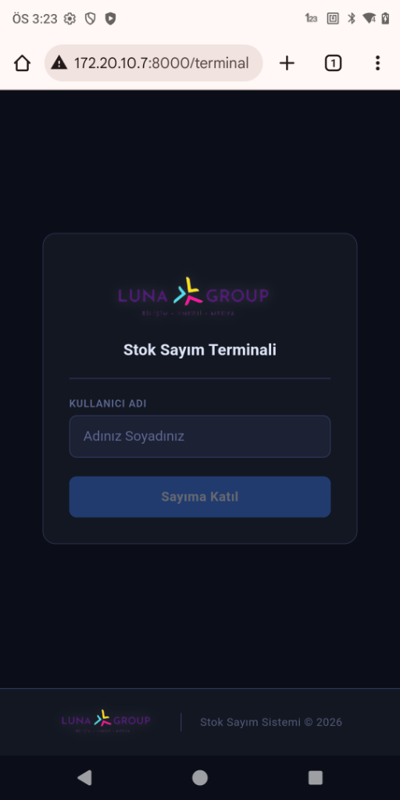
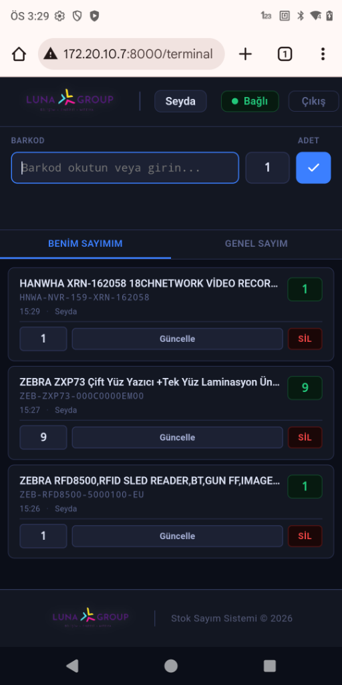

# Stok Sayım Sistemi (Inventory Counter)

FastAPI + WebSocket tabanlı, yerel ağ üzerinden çalışan gerçek zamanlı stok sayım uygulaması. Bir ana makine sayımı yönetir; Zebra el terminalleri (veya herhangi bir tarayıcı) barkod okutarak sayıma katılır. Tüm cihazlar WebSocket ile senkron çalışır.

## Ekran Görüntüleri

### Yönetim Paneli (Admin)

| Ürün Listesi Yükleme & Eşleştirme | Aktif Sayım Takibi |
| :---: | :---: |
|  |  |

| Cihaz Bağlantı QR Kodu |
| :---: |
|  |

### Sayım Terminali (Mobil)

| Terminal Giriş Ekranı | Terminal Sayım Ekranı |
| :---: | :---: |
|  |  |


## Özellikler

- SAP'tan alınan ürün listesi CSV'sini yükleyip kolon eşleştirmesi yapma
- Yerel ağdaki terminallerin QR kod ile hızlıca bağlanması
- Gerçek zamanlı barkod okutma, adet güncelleme, kayıt silme (WebSocket broadcast)
- Toplu silme, geri alma (undo) ve işlem geçmişi (history)
- Sayım sonucunu Excel uyumlu CSV olarak dışa aktarma
- Sunucu çökerse kaldığı yerden devam edebilmesi için oturum kalıcılığı (`session.json`)

## Proje Yapısı

```
inventory_counter/
├── client/              # Statik arayüzler
│   ├── admin.html        # Ana makine (yönetim) arayüzü
│   └── terminal.html     # Zebra / tarayıcı terminal arayüzü
├── server/               # FastAPI backend
│   ├── main.py            # API + WebSocket route'ları
│   ├── state.py           # Uygulama durumu (RAM) ve iş mantığı
│   ├── models.py          # Pydantic modelleri
│   ├── settings.json      # Kalıcı ayarlar
│   ├── session.json       # Aktif oturumun anlık kaydı (crash recovery)
│   ├── requirements.txt
│   ├── requirements-dev.txt
│   └── tests/             # pytest testleri
└── env/                  # Python sanal ortamı (git'e dahil değil)
```

## Kurulum

Python 3.11 gereklidir.

```powershell
python -m venv env
..\env\Scripts\Activate.ps1
pip install -r server\requirements.txt
```

Test bağımlılıkları için:

```powershell
pip install -r server\requirements-dev.txt
```

## Çalıştırma

`server` klasöründeyken:

```powershell
..\env\Scripts\Activate.ps1
uvicorn main:app --host 0.0.0.0 --port 8000 --reload
```

Sunucu ayağa kalktıktan sonra:

- Ana makine arayüzü: `http://localhost:8000/`
- Terminal arayüzü: `http://localhost:8000/terminal` (yerel ağdaki diğer cihazlardan `http://<sunucu-ip>:8000/terminal` ile erişilir; admin ekranındaki QR kod bu adresi otomatik oluşturur)

## Testler

`server` klasöründeyken:

```powershell
pytest
```

## Kullanım Akışı

1. Admin arayüzünden SAP ürün listesi CSV'si yüklenir, barkod/isim kolonları eşleştirilir.
2. Sayım başlatılır (`/api/session/start`).
3. Terminaller QR kod veya URL ile bağlanır, barkod okutmaya başlar.
4. Tüm okutmalar, düzenlemeler ve silmeler WebSocket üzerinden anlık olarak tüm bağlı cihazlara yansır.
5. Sayım bitirilir ve sonuç CSV olarak dışa aktarılır (`/api/export`).
